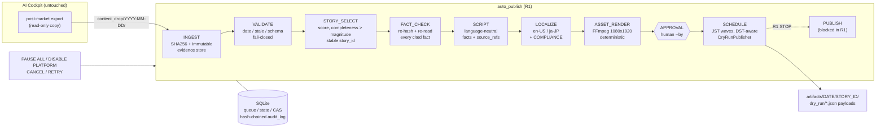

# Auto Publish System — R1 DRY-RUN

Independent subsystem that turns post-market evidence into bilingual (en-US / ja-JP) short-form drafts, a 9:16 video, and
timezone-aware posting schedules for Europe / North America.

- Current release gate: **R1 DRY-RUN** — generates a complete artifact package and schedule, **never contacts any publish API**.
- Authoritative spec: [`../docs/AUTO_PUBLISH_SYSTEM_SPEC.md`](../docs/AUTO_PUBLISH_SYSTEM_SPEC.md) / build prompt: [`../docs/CLOUD_BUILD_PROMPT_AUTO_PUBLISH_V1.md`](../docs/CLOUD_BUILD_PROMPT_AUTO_PUBLISH_V1.md)
- Hard boundary: this subsystem does not control AI Cockpit runtime or any brokerage/order execution. It never calls
  RssOrder, never submits broker orders, never touches ports 28580/28581/28582/28583, and never imports AI Cockpit code.
  The only coupling is a read-only export directory (`content_drop/YYYY-MM-DD/`).
- Standard library only (Python 3.12) + FFmpeg. No pip dependencies.

## Architecture



State machine (story): `SELECTED → FACT_CHECKED → SCRIPTED → LOCALIZED → RENDERED → AWAITING_APPROVAL → APPROVED → SCHEDULED`,
any stage `→ FAILED` (fail-closed), `→ CANCELLED`. There is no `PUBLISHING` state in R1.

## Safety properties (all covered by tests)

| Property | How |
|---|---|
| Evidence provenance | every input file SHA256-hashed, copied read-only to a content-addressed store; manifest hash per session |
| Fail-closed | missing/stale/premature/future evidence, date mismatch, weekend, schema error, tampered evidence or artifacts → `FAILED`, nothing downstream runs |
| Traceability | every sentence carries `fact_ids` → `evidence.json` → SHA256 + JSON pointer into the original file |
| Compliance | banned phrases (en/ja), unsupported profit claims, unlabeled paper/shadow results, real-account data, missing refs, empty text/captions, missing disclaimer, unlabeled fixtures |
| Approval required | only a named human (`--by`) can approve; approval binds to the exact artifact hash; any later edit blocks scheduling |
| Idempotency | stable `story_id`; re-ingest of identical input is a no-op, changed input is refused; `UNIQUE(story_id, platform)` + idempotency key; re-schedule is a no-op |
| Retry | `TransientError` retried up to `max_attempts` (story stays in place); exhaustion → `FAILED`. Compliance/evidence/validation failures are never retryable |
| Audit | every transition/control action writes a hash-chained, append-only row (DB triggers forbid UPDATE/DELETE); `audit-verify` detects tampering. JSONL ops log in `var/logs/` |
| No network | only `dry_run` adapter can be constructed; `publish()` raises; tests run the whole pipeline with sockets patched to fail and statically forbid network imports |

## Input contract

```
content_drop/2026-09-24/
  daily_summary.json         required  schema "auto_publish.daily_summary.v1"
  paper_trade_history.json   optional  entries for other dates are ignored; only triggered trades become (paper) facts
  *.png / *.txt / ...        optional  hashed as evidence only
```

`daily_summary.json` must declare `session_date`, a timezone-aware `generated_at` between the 15:30 JST close and
close + `max_evidence_age_hours`, a `source` (`ai_cockpit_export` | `manual` | `TEST_FIXTURE`), `movers[]`
(`ticker`, `name_en`, `name_ja`, `close`, `change_pct`, optional `volume_ratio`) and optional `radar_events[]`
(`ticker`, `time_jst`, `event`). See `tests/fixtures/content_drop/2026-09-24/` (fictional tickers, labelled TEST FIXTURE).

## Real data: read-only exporter (AI Cockpit → daily_summary.v1)

```powershell
py -3.12 -m auto_publish.cli export --date 2026-09-25 `
  --data-json C:\path\to\trade-cockpit\data.json `
  --paper-history C:\path\to\trade-cockpit\paper_trade_history.json `
  --out D:\content_drop
py -3.12 -m auto_publish.cli ingest --input D:\content_drop\2026-09-25
```

- Inputs are only read (opened read-only, SHA256 before parsing and re-checked after). Output never overlaps the inputs.
- **Allowlist only.** `data.json` stocks: `ticker, price→close, prev_close (consistency check only), change_pct, rvol→volume_ratio,
  data_date, ok, quote_verified, identity_verified`, name from the stock key. `paper_trade_history.json`: `date, ticker, side,
  entry, triggered, result→outcome/closed, r (closed trades only), source`. Everything else is dropped and listed in
  `export_manifest.json` (e.g. `shares, pnl_yen, fees, slippage, simulated_fill, stop, target1/2, strategy_*, MFE/MAE,
  turnover, quote_status, secondary_source, chart`); the output is also scanned against a denylist.
- Fail-closed: snapshot `data_date` ≠ session, snapshot outside close…close+18h, no verified quotes, non-finite or inconsistent
  numbers (change_pct vs price/prev_close), unknown trade `result`/`side`/`source`, closed trade without `r`, weekend.
- Unverified quotes and unpublishable trades (not triggered, "順序不明") are excluded with a reason in the manifest.
- Open (mark-to-market) paper trades are exported with `closed:false, r:null` and rendered as "still open at the close".
- Output is labelled `source: ai_cockpit_export`, `data_class: real`; every record has `source_ref` {file, sha256, pointer}
  back to the original bytes. English names come from `config/instrument_names_en.json` (else `TSE <code>`).
- Real data still stops at R1: dry-run payloads only, `data_class: "real"` recorded in each payload.

## Opportunity Radar: `condition_log.csv` (read-only, any local path)

```powershell
py -3.12 -m auto_publish.cli export --date 2026-09-25 `
  --data-json C:\path\to\trade-cockpit\data.json `
  --paper-history C:\path\to\trade-cockpit\paper_trade_history.json `
  --condition-log D:\ms2_live\records\2026-09-25\condition_log.csv `
  --out D:\content_drop
py -3.12 -m auto_publish.cli explain <story_id>     # why this ticker was chosen + full evidence chain (local only)
```

- The file is never committed to GitHub; pass its local path. It is read once (one byte snapshot, SHA256 recorded);
  the collector may keep appending — only a rewrite/truncation of the bytes we read is fail-closed.
- Strict format: exact 25-column header of the MS2 collector, `YYYY-MM-DD HH:MM:SS` JST, `NNNN.T` tickers, `True`/`False`
  flags, finite numbers, all rows on the session date, non-decreasing time, one physical line per record.
- Events = first row where a flag holds for (ticker, event) — repeated snapshots and duplicate rows are one event.
  `event_id = sha256(session|ticker|event|captured_at)`; `source_ref` = file SHA256 + row number + row SHA256.

| flag | public event | direction | public basis codes |
|---|---|---|---|
| or5_long / or5_short | or5_breakout / or5_breakdown | up / down | close above OR5 high / below OR5 low, price vs VWAP |
| or15_long / or15_short | or15_breakout / or15_breakdown | up / down | close above OR15 high / below OR15 low, price vs VWAP |
| pullback_long / pullback_short | or15_retest_hold / or15_retest_reject | up / down | retest of OR15 high held / low rejected, price vs VWAP |

- **Public** (`daily_summary.radar_events`): event_id, ticker, name, JST time, event, direction, price at detection,
  above/below VWAP, basis codes, source, source_ref. No score/confidence exists in the source, so none is published.
- **Internal** (`internal/radar_internal.json`, local evidence only): ema9/ema20, VWAP value, OR levels, bar_burst,
  flow_bias, trend/whipsaw/chase guards, collector signal/strategy labels. Used only by `explain`; tests assert none of it
  reaches posts, captions, video text or payloads.
- Contradictions are fail-closed (e.g. a long flag while price is below VWAP, a flag outside 09:00–15:30).
- Synthetic inputs must be exported with `--fixture` (tickers `TST*`); mixing synthetic and real inputs is refused.

## Output (per story)

```
var/artifacts/2026-09-24/<story_id>/
  master_1080x1920.mp4   30 s, H.264/AAC, burned-in English captions, end disclaimer
  cover.jpg
  captions.srt           built from the final approved script
  story.json             canonical language-neutral story (facts + source_refs)
  post_en.json / post_ja.json
  evidence.json          source refs with SHA256, pointer and value
  render_manifest.json   exact ffmpeg argv, ffmpeg version, font/input/output SHA256s, probe
  render_inputs/         the text files drawn into the video
  schedule.json          (after schedule)
  dry_run/<platform>.json exact payload that WOULD be sent (after schedule)
```

## Windows local setup

```powershell
# 1. Python 3.12 (python.org installer, tick "Add to PATH") and FFmpeg
winget install Python.Python.3.12
winget install Gyan.FFmpeg          # provides ffmpeg.exe and ffprobe.exe on PATH (open a new terminal afterwards)

# 2. From the repository root
cd C:\path\to\trade-cockpit
py -3.12 -m unittest discover -s auto_publish/tests -t .      # full suite, needs FFmpeg

# 3. Fonts: C:/Windows/Fonts/arial.ttf is used automatically; override with a config overlay if needed:
#    {"render": {"font_candidates": ["C:/Windows/Fonts/meiryo.ttc"]}}
```

State lives in `auto_publish\var\` (git-ignored) or `%AUTO_PUBLISH_HOME%`.

### Post-market run (manual approval stays mandatory)

```powershell
py -3.12 -m auto_publish.cli ingest --input D:\content_drop\2026-09-24
py -3.12 -m auto_publish.cli build-drafts --date 2026-09-24
py -3.12 -m auto_publish.cli queue
py -3.12 -m auto_publish.cli show <story_id>             # exact final script/caption (en + ja)
py -3.12 -m auto_publish.cli show-evidence <story_id>
py -3.12 -m auto_publish.cli approve <story_id> --by yusuke
py -3.12 -m auto_publish.cli schedule <story_id>         # writes dry_run payloads, never sends
```

Controls: `pause-all`, `resume-all`, `disable-platform <p>`, `enable-platform <p>`, `cancel <id> --reason`,
`retry <id> --reason`, `audit-verify`. Global flags: `--home`, `--config <overlay.json>`, `--now <ISO>` (reproducible runs),
`--actor`. Exit codes: 0 ok, 2 refused/fail-closed, 1 unexpected.

Windows Task Scheduler (ingest + drafts only; approval is a human step):

```powershell
schtasks /Create /TN "AutoPublish-R1-Drafts" /SC WEEKLY /D MON,TUE,WED,THU,FRI /ST 15:50 `
  /TR "cmd /c cd /d C:\path\to\trade-cockpit && py -3.12 -m auto_publish.cli ingest --input D:\content_drop\%DATE_DIR% && py -3.12 -m auto_publish.cli build-drafts --date %DATE_DIR%"
```

(`%DATE_DIR%` must be produced by a wrapper script; a ready-made wrapper is on the R1 follow-up list.)

## Scheduling baseline (JST, from spec §6)

| Platform | Wave | JST | Audience TZ |
|---|---|---|---|
| x | europe | 22:00–24:00 session day | Europe/London |
| tiktok | europe → na_tiktok | 22:00–24:00, else 05:00–07:00 next day | London / New York |
| youtube_shorts | na_shorts | 08:00–10:00 next day | America/New_York |

Slots are every 30 min, at least 10 min in the future, never double-booked per platform. If the window has passed the
schedule is refused (fail-closed) instead of posting late. Baseline only — TimingOptimizer replaces it after ≥14 days /
≥30 posts per platform (not in R1).

## Tests

```bash
python3.12 -m unittest discover -s auto_publish/tests -t . -v
AUTO_PUBLISH_UPDATE_GOLDEN=1 python3.12 -m unittest auto_publish.tests.test_story_select   # regenerate goldens deliberately
```

FFmpeg-dependent tests **fail** when FFmpeg is missing (set `AUTO_PUBLISH_ALLOW_NO_FFMPEG=1` to mark them skipped
explicitly). CI: `.github/workflows/auto-publish-r1.yml` installs FFmpeg + DejaVu fonts on Python 3.12.

## Not in R1

Real platform adapters / OAuth, PUBLISH/VERIFY/METRICS/LEARN stages, TimingOptimizer, TTS narration (video carries a silent
AAC track), Japanese subtitle line in the video, real `condition_log.csv` not yet run (importer done, tested on a synthetic file in the exact collector format), TSE holiday calendar (weekends only),
APScheduler daemon, approval UI.
