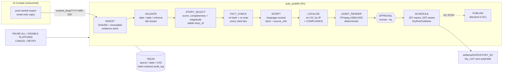

# Auto Publish System — R1 DRY-RUN

Independent subsystem that turns post-market evidence into bilingual (en-US / ja-JP) short-form drafts, a 9:16 video, and
timezone-aware posting schedules for Europe / North America.

- Current release gate: **R1 DRY-RUN** — generates a complete artifact package and schedule, **never contacts any publish API**.
- Authoritative spec: [`../docs/AUTO_PUBLISH_SYSTEM_SPEC.md`](../docs/AUTO_PUBLISH_SYSTEM_SPEC.md) / build prompt: [`../docs/CLOUD_BUILD_PROMPT_AUTO_PUBLISH_V1.md`](../docs/CLOUD_BUILD_PROMPT_AUTO_PUBLISH_V1.md)
- Hard boundary: this subsystem does not control AI Cockpit runtime or any brokerage/order execution. It never calls
  RssOrder, never submits broker orders, never touches ports 28580/28581/28582/28583, and never imports AI Cockpit code.
  The only coupling is a read-only export directory (`content_drop/YYYY-MM-DD/`).
- Standard library only (Python 3.12) + FFmpeg. No pip dependencies.

## Architecture


```mermaid
flowchart LR
    subgraph AIC["AI Cockpit (untouched)"]
        EXP["post-market export<br/>(read-only copy)"]
    end
    EXP -->|"content_drop/YYYY-MM-DD/"| ING

    subgraph AP["auto_publish (R1)"]
        direction LR
        ING["INGEST<br/>SHA256 + immutable<br/>evidence store"] --> VAL["VALIDATE<br/>date / stale / schema<br/>fail-closed"]
        VAL --> SEL["STORY_SELECT<br/>score, completeness &gt; magnitude<br/>stable story_id"]
        SEL --> FC["FACT_CHECK<br/>re-hash + re-read<br/>every cited fact"]
        FC --> SCR["SCRIPT<br/>language-neutral<br/>facts + source_refs"]
        SCR --> LOC["LOCALIZE<br/>en-US / ja-JP<br/>+ COMPLIANCE"]
        LOC --> REN["ASSET_RENDER<br/>FFmpeg 1080x1920<br/>deterministic"]
        REN --> APR{{"APPROVAL<br/>human --by"}}
        APR --> SCH["SCHEDULE<br/>JST waves, DST-aware<br/>DryRunPublisher"]
        SCH -. "R1 STOP" .-> PUB["PUBLISH<br/>(blocked in R1)"]
    end

    DB[("SQLite<br/>queue / state / CAS<br/>hash-chained audit_log")]
    AP --- DB
    SCH --> OUT["artifacts/DATE/STORY_ID/<br/>dry_run/*.json payloads"]
    CTRL["PAUSE ALL / DISABLE PLATFORM<br/>CANCEL / RETRY"] --> AP
```

State machine (story): `SELECTED → FACT_CHECKED → SCRIPTED → LOCALIZED → RENDERED → AWAITING_APPROVAL → APPROVED → SCHEDULED`,
any stage `→ FAILED` (fail-closed), `→ CANCELLED`. There is no `PUBLISHING` state in R1.

## Safety properties (all covered by tests)

| Property | How |
|---|---|
| Evidence provenance | every input file SHA256-hashed, copied read-only to a content-addressed store; manifest hash per session |
| Fail-closed | missing/stale/premature/future evidence, date mismatch, weekend, schema error, tampered evidence or artifacts → `FAILED`, nothing downstream runs |
| Traceability | every sentence carries `fact_ids` → `evidence.json` → SHA256 + JSON pointer into the original file |
| Compliance | banned phrases (en/ja), unsupported profit claims, unlabeled paper/shadow results, real-account data, missing refs, empty text/captions, missing disclaimer, unlabeled fixtures |
| Approval required | only a named human (`--by`) can approve; approval binds to the exact artifact hash; any later edit blocks scheduling |
| Idempotency | stable `story_id`; re-ingest of identical input is a no-op, changed input is refused; `UNIQUE(story_id, platform)` + idempotency key; re-schedule is a no-op |
| Retry | `TransientError` retried up to `max_attempts` (story stays in place); exhaustion → `FAILED`. Compliance/evidence/validation failures are never retryable |
| Audit | every transition/control action writes a hash-chained, append-only row (DB triggers forbid UPDATE/DELETE); `audit-verify` detects tampering. JSONL ops log in `var/logs/` |
| No network | only `dry_run` adapter can be constructed; `publish()` raises; tests run the whole pipeline with sockets patched to fail and statically forbid network imports |

## Input contract

```
content_drop/2026-09-24/
  daily_summary.json         required  schema "auto_publish.daily_summary.v1"
  paper_trade_history.json   optional  entries for other dates are ignored; only triggered trades become (paper) facts
  *.png / *.txt / ...        optional  hashed as evidence only
```

`daily_summary.json` must declare `session_date`, a timezone-aware `generated_at` between the 15:30 JST close and
close + `max_evidence_age_hours`, a `source` (`ai_cockpit_export` | `manual` | `TEST_FIXTURE`), `movers[]`
(`ticker`, `name_en`, `name_ja`, `close`, `change_pct`, optional `volume_ratio`) and optional `radar_events[]`
(`ticker`, `time_jst`, `event`). See `tests/fixtures/content_drop/2026-09-24/` (fictional tickers, labelled TEST FIXTURE).

## Real data: read-only exporter (AI Cockpit → daily_summary.v1)

```powershell
py -3.12 -m auto_publish.cli export --date 2026-09-25 `
  --data-json C:\path\to\trade-cockpit\data.json `
  --paper-history C:\path\to\trade-cockpit\paper_trade_history.json `
  --out D:\content_drop
py -3.12 -m auto_publish.cli ingest --input D:\content_drop\2026-09-25
```

- Inputs are only read (opened read-only, SHA256 before parsing and re-checked after). Output never overlaps the inputs.
- **Allowlist only.** `data.json` stocks: `ticker, price→close, prev_close (consistency check only), change_pct, rvol→volume_ratio,
  data_date, ok, quote_verified, identity_verified`, name from the stock key. `paper_trade_history.json`: `date, ticker, side,
  entry, triggered, result→outcome/closed, r (closed trades only), source`. Everything else is dropped and listed in
  `export_manifest.json` (e.g. `shares, pnl_yen, fees, slippage, simulated_fill, stop, target1/2, strategy_*, MFE/MAE,
  turnover, quote_status, secondary_source, chart`); the output is also scanned against a denylist.
- Fail-closed: snapshot `data_date` ≠ session, snapshot outside close…close+18h, no verified quotes, non-finite or inconsistent
  numbers (change_pct vs price/prev_close), unknown trade `result`/`side`/`source`, closed trade without `r`, weekend.
- Unverified quotes and unpublishable trades (not triggered, "順序不明") are excluded with a reason in the manifest.
- Open (mark-to-market) paper trades are exported with `closed:false, r:null` and rendered as "still open at the close".
- Output is labelled `source: ai_cockpit_export`, `data_class: real`; every record has `source_ref` {file, sha256, pointer}
  back to the original bytes. English names come from `config/instrument_names_en.json` (else `TSE <code>`).
- Real data still stops at R1: dry-run payloads only, `data_class: "real"` recorded in each payload.

## Opportunity Radar: `condition_log.csv` (read-only, any local path)

```powershell
py -3.12 -m auto_publish.cli export --date 2026-09-25 `
  --data-json C:\path\to\trade-cockpit\data.json `
  --paper-history C:\path\to\trade-cockpit\paper_trade_history.json `
  --condition-log D:\ms2_live\records\2026-09-25\condition_log.csv `
  --out D:\content_drop
py -3.12 -m auto_publish.cli explain <story_id>     # why this ticker was chosen + full evidence chain (local only)
```

- The file is never committed to GitHub; pass its local path. It is read once (one byte snapshot, SHA256 recorded);
  the collector may keep appending — only a rewrite/truncation of the bytes we read is fail-closed.
- Strict format: exact 25-column header of the MS2 collector, `YYYY-MM-DD HH:MM:SS` JST, `NNNN.T` tickers, `True`/`False`
  flags, finite numbers, all rows on the session date, non-decreasing time, one physical line per record.
- Events = first row where a flag holds for (ticker, event) — repeated snapshots and duplicate rows are one event.
  `event_id = sha256(session|ticker|event|captured_at)`; `source_ref` = file SHA256 + row number + row SHA256.

| flag | public event | direction | public basis codes |
|---|---|---|---|
| or5_long / or5_short | or5_breakout / or5_breakdown | up / down | close above OR5 high / below OR5 low, price vs VWAP |
| or15_long / or15_short | or15_breakout / or15_breakdown | up / down | close above OR15 high / below OR15 low, price vs VWAP |
| pullback_long / pullback_short | or15_retest_hold / or15_retest_reject | up / down | retest of OR15 high held / low rejected, price vs VWAP |

- **Public** (`daily_summary.radar_events`): event_id, ticker, name, JST time, event, direction, price at detection,
  above/below VWAP, basis codes, source, source_ref. No score/confidence exists in the source, so none is published.
- **Internal** (`internal/radar_internal.json`, local evidence only): ema9/ema20, VWAP value, OR levels, bar_burst,
  flow_bias, trend/whipsaw/chase guards, collector signal/strategy labels. Used only by `explain`; tests assert none of it
  reaches posts, captions, video text or payloads.
- Contradictions are fail-closed (e.g. a long flag while price is below VWAP, a flag outside 09:00–15:30).
- Synthetic inputs must be exported with `--fixture` (tickers `TST*`); mixing synthetic and real inputs is refused.

## TSE trading-day calendar

`config/tse_calendar.json` (JPX 休業日一覧, cross-checked with 内閣府 国民の祝日; sources + retrieval date inside the file).
VALIDATE and `export` accept a session only if it is a covered year, Mon–Fri, not a JPX closure (holidays, 12/31, 1/1–1/3)
and not an owner-added `extra_closures` entry. Anything else is `NOT_TRADING_DAY`; a year that is not covered is
`CALENDAR_UNAVAILABLE` (fail-closed, never guessed). `session_overrides` can set a different close time for one session.
The calendar SHA256 is recorded in the VALIDATE audit row. Currently covered: 2026–2027 (add a year only after JPX publishes it).

```powershell
py -3.11 -m auto_publish.cli calendar --date 2026-09-18 --days 7
```

## Narration (TTS) and multilingual subtitles

Config `tts.voices.<lang>` selects an **offline** provider per language: `silent` (default, R1 behaviour),
`fake_tone` (test-only, deterministic tone; refused for non-fixture data). `windows_sapi` / `espeak_ng` are designed
but not yet implemented (owner-PC phase) and fail closed (`TTS_PROVIDER_UNAVAILABLE`); any other provider (cloud/paid)
is rejected at config load (`TTS_PROVIDER_NOT_ALLOWED`).

* Narration reads exactly the approved segment text. With a narrating provider each segment lasts
  max(4.0 s, audio + 0.4 s); the total must be 20–45 s or the story fails closed (`NARRATION_TOO_LONG` /
  `NARRATION_TOO_SHORT`, non-retryable; text is never shortened automatically). `silent` keeps the fixed 6 s layout,
  and the English master/cover/captions are byte-identical to R1.
* `narration_<lang>.wav` (mono 16-bit, 24 kHz) and `tts_manifest.json` (provider, voice, engine, per-segment text/audio
  SHA256, boundaries) are artifacts inside the approval content hash: changing audio after approval blocks scheduling
  (`ARTIFACT_TAMPERED`); approve/schedule also re-check that the narration was made for the approved text.
* Subtitles: `captions_<lang>.srt` for en-US and ja-JP from the same boundaries as that language's narration
  (`captions.srt` = English, kept for compatibility). Japanese lines are wrapped by display width (full-width = 2,
  32 cells ≈ 16 characters), with kinsoku and number+unit runs (`2,345円`, `+6.40%`, `09:12`) never split.
* `render.variants`: `["en_primary"]` (default) or `["en_primary", "ja_primary"]`; `ja_primary` renders
  `master_ja_1080x1920.mp4` / `cover_ja.jpg` with Japanese text and narration. Fonts per language in `render.fonts`
  (ja-JP: Noto Sans CJK on Linux, Yu Gothic / Meiryo on Windows); no usable font → `FONT_MISSING` before encoding.

## Dry-run E2E: WOULD_PUBLISH simulator (network-free)

`would-publish` evaluates every schedule whose time has come. `would_publish` is an **audit event**, not a
publication: it records that, at the scheduled time, every precondition for sending held in DRY-RUN. Nothing is sent,
no network is used, and the story stays `SCHEDULED` (R1 has no PUBLISH state). Run it by hand; no daemon or Task
Scheduler entry is installed.

```
per schedule:  SCHEDULED -> DISPATCHING -> WOULD_PUBLISH                  (all checks pass)
                                       -> BLOCKED                         (any check fails; terminal)
                                       -> SCHEDULED / CANCELLED           (kill switch / cancel mid-flight; attempt ABORTED)
                                       -> UNKNOWN                         (crash: in-flight past its lease; terminal, never resent)
               SCHEDULED -> MISSED                                        (> dispatch.max_lateness_minutes late; never sent late)
```

Checks at the scheduled time: story still SCHEDULED and approved; adapter is dry_run; audit hash chain intact;
approval and schedule rows equal the audited ones; evidence store hashes; every artifact (video, cover, captions,
narration, manifests) equals the approved content hash; compliance; narration text == approved text; payload file
unchanged, valid against the frozen contract (`auto_publish.payload_contract.v1`: YouTube private / TikTok SELF_ONLY /
X ≤ 280 weighted chars with disclaimer) and byte-identical to what the approved content produces now.
The result (`dispatches` table + `would_publish` audit row) carries a trace binding story → approval → evidence →
artifacts → payload → slot. One attempt per schedule and one WOULD_PUBLISH per idempotency key are enforced by the DB;
outcomes are immutable.

Kill switches: PAUSE ALL stops the whole run; a disabled platform is skipped; both (and CANCEL) are re-checked inside the
recording transaction, so a switch thrown mid-flight aborts the attempt. `kill-switch-drill --input <fixture drop>`
rehearses PAUSE ALL, mid-flight pause, DISABLE PLATFORM and CANCEL in an isolated temporary home (fixture data only).

```powershell
py -3.11 -m auto_publish.cli would-publish                 # evaluate due schedules (real clock; --now only in a sandbox home)
py -3.11 -m auto_publish.cli dispatches --story <story_id> # outcomes + traces
py -3.11 -m auto_publish.cli kill-switch-drill --input auto_publish\tests\fixtures\content_drop\2026-09-24
```

## Timing optimisation (proposal-only; never changes a schedule)

Owner-exported post metrics are imported **read-only** from a normalised CSV (`auto_publish.post_metrics_csv.v1`):

```
platform,post_ref,story_id,published_at,observed_at,impressions,views,watch_time_seconds,completion_rate,likes,comments,shares,saves,follows_gained,video_duration_seconds
```

UTF-8 (Excel BOM ok); timestamps must carry an offset; counts are non-negative integers; blank = "not available" (never 0);
`completion_rate` 0..1; `views <= impressions`; `observed_at >= published_at`; nothing in the future; every row's
platform must equal `--platform`. The whole file is rejected on any error. The raw bytes are hashed and copied to a
read-only store (`metrics_store/`); re-importing the same file is a no-op; a later snapshot of a post is appended, the same
(post, observed_at) with different numbers is refused (`METRICS_CONFLICT`). All metrics tables are append-only.

* **Point-in-time**: `as_of` must be strictly before the current second (future/current → `AS_OF_NOT_IN_PAST`;
  default = the previous second); at most one proposal per platform + as_of (a different re-evaluation is refused,
  `PROPOSAL_AS_OF_CONFLICT`). A dataset "as of T" uses rows imported by T and observed by T; each post is scored at a fixed age
  (first snapshot 24–48 h after publication). Later imports never change an earlier result.
* **Allowed slots** = the approved waves × 30 min (no new times); the fixed slot is the scheduler's first slot. Posts
  outside them are excluded. Platforms are never mixed and metrics are never summed into one score.
* **Sample gate**: ≥ 14 distinct days and ≥ 30 posts per platform, data not stale (≤ 30 days) — else `UNKNOWN`,
  nothing is proposed and the fixed slots stay. These floors cannot be lowered by config.
* **Algorithm `slot_ts_normal.v1`**: Thompson sampling on log1p(objective at 24 h) per allowed slot, seeded by the input
  hash. `PROPOSED` only if a tested slot has P(best) ≥ 0.9 and P(> fixed) ≥ 0.9 and guardrails (completion /
  engagement) are not worse by > 10 %; otherwise `BASELINE_CONFIRMED` or `INCONCLUSIVE`. Exploration ≤ 20 %.
  Evidence is observational (`causal_claim: false`).
* **Shadow**: `shadow-eval` compares posts in the fixed slot vs the proposed slot(s) published after the proposal,
  per metric; `UNKNOWN` when either side has < 5 posts.

```powershell
py -3.11 -m auto_publish.cli metrics-import --platform tiktok --csv D:\exports\tiktok_metrics.csv
py -3.11 -m auto_publish.cli metrics-report --platform tiktok
py -3.11 -m auto_publish.cli propose-slots --platform tiktok       # stored as a proposal; schedules unchanged
py -3.11 -m auto_publish.cli shadow-eval --proposal 1
```

## Shadow operation (contract `auto_publish.shadow_day.v1`)

`shadow-day --date D [--as-of T]` stores one append-only, point-in-time evidence record for a trading session; it
changes no story / schedule / dispatch / proposal and never sends anything. `shadow-summary --from D1 --to D2`
aggregates stored records only (it never re-evaluates the pipeline).

* **Times**: `observation_as_of_utc` (T, must be before the current second) is part of the identity and the hash;
  `generated_at_utc` (wall clock) is stored beside the record, never hashed. Same data + same T = same hash.
* **Point-in-time**: state is reconstructed from audit rows stamped ≤ T (stories, schedules, dispatches, proposals,
  kill switches). Backdated or future-stamped evidence → `UNKNOWN` (`AUDIT_TIME_NON_MONOTONIC`, `FUTURE_EVIDENCE`).
* **Verdicts** per check: `VERIFIED` / `VIOLATION` / `UNKNOWN` / `NOT_APPLICABLE`; `day_status` OK / UNKNOWN /
  VIOLATION. Recorded outcomes (WOULD_PUBLISH, BLOCKED, …) are copied, never re-classified. Checks: audit chain,
  audit time order, WOULD_PUBLISH trace vs files, duplicates (idempotency key / story×platform / dispatch id / payload
  hash), proposal reproducibility (compared only when the stored input hash is reproduced, else
  `CONDITIONS_NOT_REPRODUCIBLE`), human approval evidence, compliance. Fail-closed codes are counted by code and by
  category (stale / missing / unknown / future / integrity / other).
* **Identity** (session, T, contract): identical re-run = no-op; different content = `SHADOW_DAY_CONFLICT`
  (nothing is updated; DB triggers forbid UPDATE/DELETE).
* **Canonical hash**: `sha256(b"auto_publish.shadow_day.v1\n" + canonical_json(report))`; keys sorted, UTC
  `YYYY-MM-DDTHH:MM:SSZ` timestamps, no floats, explicit nulls, fixed list order.
* The Japanese subtitle "suspected mid-word break" count is a heuristic observation (`used_for_safety: false`).

Canonical relative paths: `artifacts.rel_path`, `schedules.payload_path`, the SCHEDULE audit detail and
WOULD_PUBLISH `trace.payload.path` are stored "/"-separated on every OS (`pipeline.rel_posix`), so the same logical
input gives the same bytes and hashes on Windows and Linux (fixture shadow hashes are locked in
`tests/golden/shadow_fixture.json`). Version boundary: records written before this change on Windows may contain
"\\"; they are immutable evidence and are read as they are, never rewritten or migrated.

Known constraint — portability (accepted, not fixed): the evidence store and the metrics store are referenced from
the DB by ABSOLUTE path. If a home is moved, copied to another path, migrated to another PC or restored from a backup
at a different location, those references no longer resolve and verification fails closed (e.g. proposal
re-verification → `METRICS_STORE_TAMPERED` → shadow verdict `UNKNOWN`; evidence verification → `EVIDENCE_*`).
Nothing unsafe happens, but keep a home at its original path until a dedicated migration/relocation phase exists.

### Multi-business-day observation (contract `auto_publish.shadow_period.v1`)

`shadow-period --from D1 --to D2 [--as-of T]` stores one append-only, point-in-time record for a range of dates
(1–62 days). It reads only the TSE calendar, STORED `shadow_day.v1` records knowable at T
(`observation_as_of_utc ≤ T` and `generated_at_utc ≤ T`) and audit rows stamped ≤ T; it never re-evaluates or
rewrites a past day and changes no pipeline state (the only write is the record + its audit row).

* **Per date**: `CLOSED` (weekend / holiday, from the calendar) · `PENDING` (not yet due, no final record) ·
  otherwise the verdict of the latest visible day record plus period-level evidence checks. A trading date is *due*
  at the end of its last configured wave + `max_lateness_minutes` + `lease_seconds` (recorded as `due_rule`).
* **Fail-closed (UNKNOWN)** for a due date: `SESSION_MISSING`, `SHADOW_DAY_MISSING`, `SHADOW_DAY_PREMATURE` (only
  a record made before the day resolved), `SCHEDULE_UNRESOLVED_AFTER_DUE` (not held by a kill switch),
  `SHADOW_RECORD_TAMPERED`, `SHADOW_RECORD_UNANCHORED` (no matching audit row), `SESSION_ON_CLOSED_DAY`.
  **VIOLATION**: `AUDIT_HEAD_MISSING` (audit the day was based on is gone), `DRY_RUN_BOUNDARY`, cross-day duplicates
  (same payload / trace / story under two session dates), broken audit chain.
* Kill switch / disabled platform: schedules held by them are *resolved* (reported as `held_by_kill_switch`), not
  UNKNOWN; such days are not full-chain days.
* **Acceptance gate**: `met` iff `period_status` is OK and at least `shadow.acceptance_trading_days` (default 5)
  trading days are *full-chain* (final, OK, ≥1 WOULD_PUBLISH, every scheduled story has verified human approval).
* Identity (from, to, T, contract): identical re-run = no-op; different content = `SHADOW_PERIOD_CONFLICT`.
  Canonical hash as for the day contract with domain `auto_publish.shadow_period.v1\n`; the 5-trading-day fixture
  across the 2026-09 holidays is locked in `tests/golden/shadow_period_fixture.json`.

Known Low items (tracked, not fixed): optimizer config upper bounds; shadow-eval noop may return a recomputed result;
metrics-import consistency checks and schedule() free-slot read outside the write transaction; `vwap_relation="at"`
unsupported by templates; sub-second truncation; no external anchor for the audit chain; Japanese line-break quality.

## Output (per story)

```
var/artifacts/2026-09-24/<story_id>/
  master_1080x1920.mp4   20–45 s (30 s when silent), H.264/AAC, burned-in English captions, end disclaimer
  cover.jpg
  captions.srt           built from the final approved script (English; same bytes as captions_en-US.srt)
  captions_en-US.srt / captions_ja-JP.srt
  tts_manifest.json      narration provider/voice + per-segment text/audio SHA256 and boundaries
  narration_<lang>.wav   only with a narrating provider
  master_ja_1080x1920.mp4 / cover_ja.jpg   only with the ja_primary variant
  story.json             canonical language-neutral story (facts + source_refs)
  post_en.json / post_ja.json
  evidence.json          source refs with SHA256, pointer and value
  render_manifest.json   exact ffmpeg argv, ffmpeg version, font/input/output SHA256s, probe
  render_inputs/         the text files drawn into the video
  schedule.json          (after schedule)
  dry_run/<platform>.json exact payload that WOULD be sent (after schedule)
```

## Windows local setup

```powershell
# 1. Python 3.12 (python.org installer, tick "Add to PATH") and FFmpeg
winget install Python.Python.3.12
winget install Gyan.FFmpeg          # provides ffmpeg.exe and ffprobe.exe on PATH (open a new terminal afterwards)

# 2. From the repository root
cd C:\path\to\trade-cockpit
py -3.12 -m unittest discover -s auto_publish/tests -t .      # full suite, needs FFmpeg

# 3. Fonts: C:/Windows/Fonts/arial.ttf is used automatically; override with a config overlay if needed:
#    {"render": {"font_candidates": ["C:/Windows/Fonts/meiryo.ttc"]}}
```

State lives in `auto_publish\var\` (git-ignored) or `%AUTO_PUBLISH_HOME%`.

### Post-market run (manual approval stays mandatory)

```powershell
py -3.12 -m auto_publish.cli ingest --input D:\content_drop\2026-09-24
py -3.12 -m auto_publish.cli build-drafts --date 2026-09-24
py -3.12 -m auto_publish.cli queue
py -3.12 -m auto_publish.cli show <story_id>             # exact final script/caption (en + ja)
py -3.12 -m auto_publish.cli show-evidence <story_id>
py -3.12 -m auto_publish.cli approve <story_id> --by yusuke
py -3.12 -m auto_publish.cli schedule <story_id>         # writes dry_run payloads, never sends
```

Controls: `pause-all`, `resume-all`, `disable-platform <p>`, `enable-platform <p>`, `cancel <id> --reason`,
`retry <id> --reason`, `audit-verify`. Global flags: `--home`, `--config <overlay.json>`, `--now <ISO>` / `AUTO_PUBLISH_NOW` (sandbox homes only: `sandbox-init` on an EMPTY home; a production home
refuses any clock override with `CLOCK_OVERRIDE_REFUSED`),
`--actor`. Exit codes: 0 ok, 2 refused/fail-closed, 1 unexpected.

Windows Task Scheduler (ingest + drafts only; approval is a human step):

```powershell
schtasks /Create /TN "AutoPublish-R1-Drafts" /SC WEEKLY /D MON,TUE,WED,THU,FRI /ST 15:50 `
  /TR "cmd /c cd /d C:\path\to\trade-cockpit && py -3.12 -m auto_publish.cli ingest --input D:\content_drop\%DATE_DIR% && py -3.12 -m auto_publish.cli build-drafts --date %DATE_DIR%"
```

(`%DATE_DIR%` must be produced by a wrapper script; a ready-made wrapper is on the R1 follow-up list.)

## Scheduling baseline (JST, from spec §6)

| Platform | Wave | JST | Audience TZ |
|---|---|---|---|
| x | europe | 22:00–24:00 session day | Europe/London |
| tiktok | europe → na_tiktok | 22:00–24:00, else 05:00–07:00 next day | London / New York |
| youtube_shorts | na_shorts | 08:00–10:00 next day | America/New_York |

Slots are every 30 min, at least 10 min in the future, never double-booked per platform. If the window has passed the
schedule is refused (fail-closed) instead of posting late. Baseline only — TimingOptimizer replaces it after ≥14 days /
≥30 posts per platform (not in R1).

## Tests

```bash
python3.12 -m unittest discover -s auto_publish/tests -t . -v
AUTO_PUBLISH_UPDATE_GOLDEN=1 python3.12 -m unittest auto_publish.tests.test_story_select   # regenerate goldens deliberately
```

FFmpeg-dependent tests **fail** when FFmpeg is missing (set `AUTO_PUBLISH_ALLOW_NO_FFMPEG=1` to mark them skipped
explicitly). CI: `.github/workflows/auto-publish-r1.yml` installs FFmpeg + DejaVu + Noto CJK fonts on Python 3.12.

## Not in R1

Real platform adapters / OAuth, PUBLISH/VERIFY/LEARN stages, automatic use of slot proposals, a real speech engine
(Windows SAPI provider: owner-PC phase), pronunciation lexicon, loudness normalisation, APScheduler daemon, approval UI.
Design for the next phase (TTS, Japanese subtitles, timing optimisation, dry-run E2E): [`docs/NEXT_PHASE_DESIGN.md`](docs/NEXT_PHASE_DESIGN.md).
R1 real-data acceptance: PASS on 0597b81 (owner PC, 2026-09-24 session); Windows fixes 07193fc / 379f16c.
